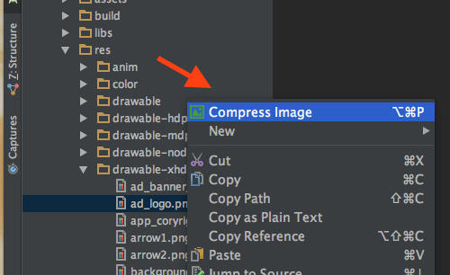
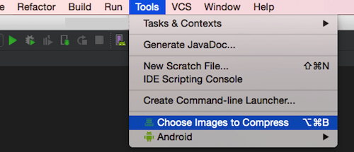
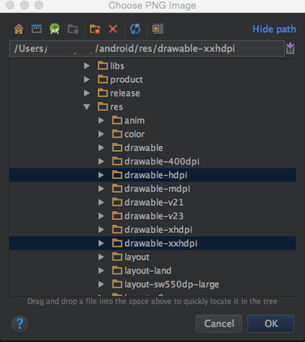

# Biu | [English](index)

Biu是一款为IntelliJ IDEA设计的图片压缩插件，同时适用于基于IntelliJ开发的Android Studio。  
通过Biu您可以在IDE内“一键”压缩工程内的PNG图片资源。

以下是我们支持的一些操作：

* 支持右键压缩选中的PNG图片
* 支持批量压缩选中的文件夹内的所有PNG图片
* 支持通过文件选择器勾选所需压缩的PNG/文件夹
* 支持快捷键操作
* 支持压缩模式选择：[pngquant](https://pngquant.org/) 和 [tinypng](https://tinypng.com/)

*目前Biu仅适用与macOS，Win和 Uniux暂未适配*

## 安装

* 通过本地磁盘安装：设置/插件/从磁盘安装
* 通过maven仓库安装：设置/插件/浏览Maven仓库, 检索关键词Biu[^1]

[^1]: 注：暂未上传Maven仓库

## 使用

* 右键压缩选中的PNG图片

* 批量压缩选中的文件夹内的所有PNG图片

* 通过文件选择器勾选所需压缩的PNG/文件夹

  

* 快捷键

操作 | 快捷键 
------------ | -------------
右键快速压缩   | ⌥⌘P
工具栏批量压缩 | ⌥⌘B

* 压缩模式

## 反馈

如您在使用过程中有任何疑问或者Bug，欢迎通过下方的地址进行反馈。

[https://wj.qq.com/s/1409959/ab24](https://wj.qq.com/s/1409959/ab24)
