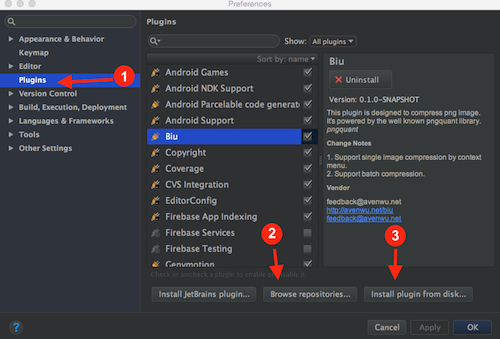
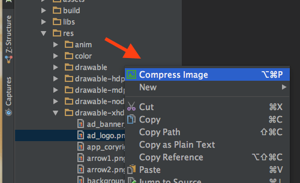
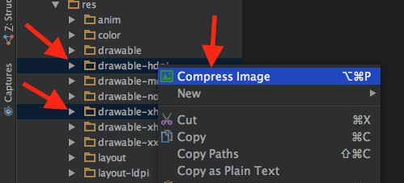
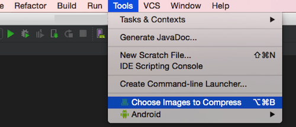
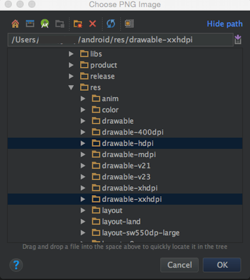
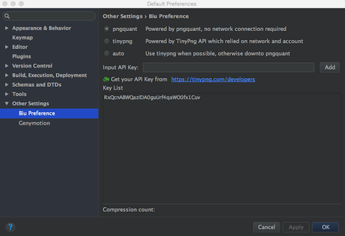

# Biu | [中文](index-zh)

Biu is a PNG compression plugin designed for IntelliJ IDEA. Which means IDE based on Intellij IDEA, such as Android Studio can also use this plugin.  
With this plugin, you can compress PNG resources inside your project directly.

All supported functions are listed bellow:

* Right click to compress selected PNG file immediately
* Right click to compress all selected PNGs or PNGs inside the folders
* View and select files through file chooser
* Keyboard shortcuts available
* Choose compress mode: [pngquant](https://pngquant.org/) or [tinypng](https://tinypng.com/)

Biu can be used under macOS, win and ubuntu;

## Installation

* Install through local disk: Setting/Plugins/Install plugin from disk
* Install through maven: Setting/Plugins/Browse repositories，search by Biu[^1]

[^1]: PS: We've not upload to maven yet

## Usage

* Right click to compress selected PNG

* Right click to compress all selected PNGs or PNGs inside the folders

* View and select files through file chooser

  

* Keyboard shortcuts

functions | shortcuts
------------ | -------------
Compress Images   | ⌥⌘P
Batch Compression | ⌥⌘B

* Compress mode

## Feedback

If you have any trouble to work with our plugin. Please send us you feedback by the link listed bellow.

[https://wj.qq.com/s/1415134/350a/](https://wj.qq.com/s/1415134/350a/)